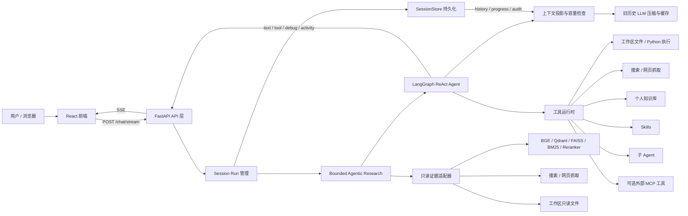
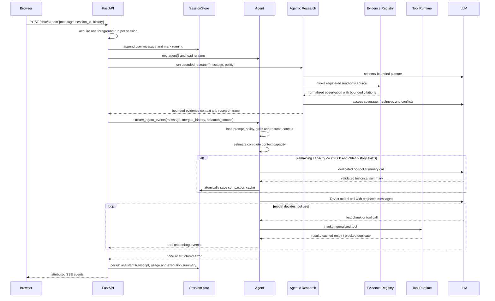
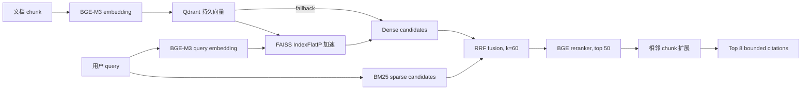
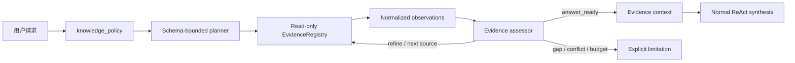

# Agent 系统技术实现文档

> 面向简历、技术面试和项目复盘的实现说明
>
> 分支：`feat/preserve-recent-tool-history`
> 上下文治理提交：`9fc573c feat: compact older conversation context`
> RAG 增量提交：`3d52233 Wire RAG to BGE Qdrant and reranker` → `40cd2d6 feat: add Feishu knowledge import and hybrid retrieval` → `5c271e2 feat: accelerate dense retrieval with faiss` → `e9e7a45 feat: add bounded agentic rag orchestration`

## 1. 项目定位

这是一个面向本地工作区的通用型 Agent 应用。它把大语言模型的自然语言理解能力与文件操作、网页搜索、网页抓取、知识库检索、技能执行、子 Agent 委派和多模态分析组合起来，并通过会话持久化、工具审计、上下文容量监控和 Server-Sent Events（SSE）构成一条可恢复、可观测的执行链路。

项目的核心目标不是把业务实体写死在代码中，而是由 Agent 通过通用工具和提示词完成任务理解，运行时只负责提供约束、执行能力和证据记录。分支的主要工程改进是：当上下文接近模型窗口上限时，只压缩较早历史，同时完整保留最近三轮对话中的原生工具调用和结果，避免因为截断工具协议而破坏下一轮模型调用。

## 2. 总体架构



### 2.1 模块职责

| 模块 | 主要职责 | 关键实现 |
| --- | --- | --- |
| `backend/main.py` | HTTP API、运行互斥、SSE 编排、结果收尾 | `/chat/stream`、`/chat`、`_ACTIVE_RUNS`、run attribution |
| `backend/agent.py` | Agent 构建、ReAct 事件流、上下文组装、修复续跑 | `create_react_agent`、`astream_events(version="v2")` |
| `backend/tools.py` | 工具集合、工具策略、缓存、去重、审计和安全边界 | 规范化调用键、跨轮次复用、副作用阻断 |
| `backend/session_store.py` | canonical session、任务计划、工具事件和结果缓存 | `session.json`、`task_plan.json`、JSONL 审计 |
| `backend/context_compaction.py` | 旧历史分区、分块摘要、字面量校验、缓存 provenance | 指纹、边界、schema/prompt 版本 |
| `backend/rag/` | 文档解析、增量索引、混合检索、引用和评估 | 结构优先切分、RRF、citation metadata |
| `backend/rag/retrieval.py` | 本地 embedding、Qdrant 向量存储、FAISS 加速、reranker 和后端错误 | BGE-M3、向量维度校验、Index fallback、分数拆解 |
| `backend/rag/faiss_index.py` | 持久化 dense 检索加速器和元数据 sidecar | `IndexFlatIP`、重建、过滤、增删同步 |
| `backend/rag/bm25.py` | 稀疏词法检索 | IDF、词频饱和、长度归一化、BM25 参数化 |
| `backend/agentic_research/` | 证据路由、只读适配器、评估和有限重规划 | policy、schema plan、budget、provenance |
| `backend/skills.py` | 技能目录发现、详情按需加载和执行 | `SKILL.md`、legacy JSON、runner/LLM fallback |
| `backend/subagents.py` | 子 Agent 类型隔离、同步/后台执行、消息邮箱 | 工具黑白名单、任务状态和 SSE 通知 |
| `backend/vision.py` | 工作区图片识别和多图分析 | 路径校验、大小/数量/超时限制 |
| `frontend/src/App.jsx` | SSE 解析、流式文本、工具时间线和调试面板 | 按事件类型分发、知识库与子 Agent 面板 |
| `frontend/src/sessionRunState.js` | 前端按 session 隔离运行状态 | run attribution、追加指令路由 |

## 3. 一次请求的完整时序



请求入口在 `backend/main.py`。服务端先用 `session_id` 建立或读取会话，再通过 `_ACTIVE_RUNS` 保证同一 session 同时只有一个前台 run。每个 run 使用 `session_id:uuid` 形式的服务端标识；运行期间通过 `ContextVar` 传递到工具层，使工具缓存、审计和追加指令都能绑定到正确的 session/run。

客户端提交的历史不会直接覆盖服务端 canonical history。`_merge_history()` 优先使用已持久化历史，只接受真正位于末尾的新内容，从而避免客户端旧快照覆盖服务端已经产生的工具事件。

## 4. ReAct Agent 主循环

### 4.1 Agent 构建

`backend/agent.py:build_agent()` 完成以下工作：

1. 从外置配置加载模型连接信息。
2. 创建默认低随机性的聊天模型，并包裹 `AppendAwareChatModel`。
3. 通过 `get_all_tools()` 聚合文件、搜索、RAG、Skills、子 Agent 和可选 MCP 工具。
4. 使用 LangGraph `create_react_agent()` 编译 ReAct 图，并设置 agent 名称。

`AppendAwareChatModel` 是一个 Runnable 代理。它在每次 `invoke`、`ainvoke`、`stream` 或 `astream` 前检查当前 run 的追加指令队列，把已排队的用户追加内容插入下一次模型调用之前。这样用户可以在任务运行期间追加约束，而不会与另一个 session 的输入串线。

### 4.2 事件驱动执行

`stream_agent_events()` 使用 `agent.astream_events(..., version="v2")`，把 LangGraph/LangChain 的底层事件转换为前端稳定的事件协议：

| 事件 | 含义 |
| --- | --- |
| `text` | 模型输出的增量文本 |
| `tool_call` | 对用户可见的工具调用，包含工具名、参数和 call id |
| `tool_result` | 对用户可见的工具结果 |
| `tool_transcript_call/result` | 完整工具 transcript，主要用于服务端持久化，前端不直接展示 |
| `progress` | 当前工具或模型的等待状态和耗时 |
| `activity` | `understanding`、`working`、`judging`、`completed`、`blocked` 等任务状态 |
| `debug` | 模型、工具、上下文、缓存、重试和容量诊断 |
| `error` | 结构化失败信息和稳定错误码 |
| `done` | 本次 run 的最终文本 |

当前运行约束包括：Agent 图递归上限 `180` 步，单次请求最多 `10` 次网页搜索、`5` 次网页抓取，模型或工具异常后的修复/续跑最多 `2` 轮。代码同时维护工具调用历史、工具错误、子任务状态和模型 token usage，因而续跑时可以把已完成工作和失败证据提供给模型。

### 4.3 工具调用和结果关联

工具 start/end 事件可能来自不同的底层 run id。实现使用底层 run id 优先，并按工具名维护 FIFO pending 队列；缺少底层 id 时生成带历史指纹的 fallback id。因此同一工具调用的参数和结果仍能在前端、session transcript 和 native tool message 中配对。

最近的工具历史以 LangChain 原生消息协议回放：

```text
AIMessage(tool_calls=[{id, name, args}])
ToolMessage(tool_call_id=id, content=result)
```

对于参数不合法、孤立结果或缺少配对的旧记录，系统不直接丢弃，而是降级成带诊断信息的普通 `AIMessage`，避免向模型提供不符合 provider 协议的 dangling tool call。

### 4.4 修复和完成审计

主 Agent 并非第一次图结束就无条件返回。当前实现包含三类闭环：

- 如果事件流抛出异常，基于最近工具错误和已完成步骤生成修复指令。
- 如果模型只输出了“准备继续”之类的不完整内容，追加 continuation prompt，让模型决定是否还需要工具或直接给出最终答案。
- 如果工具返回错误、完成审计判断任务未完成，或后台子 Agent 尚未结束，则生成带工具清单、结果摘要、失败步骤和下一动作的 retry prompt。

续跑前会调用 `_repair_dangling_tool_call_messages()` 清理缺少 `ToolMessage` 的原生 tool call，并复用已有工具结果，明确要求模型不要重复成功调用。任务计划全部完成且已登记 primary result 时，completion gate 可以直接生成最终结果，减少无意义的额外模型轮次。

## 5. 会话持久化和可恢复执行

`SessionStore` 将事实源和运行投影分开：

- `session.json`：会话元数据、canonical `messages`、任务进度、执行摘要、阶段结果、子 Agent 状态和追加指令状态。
- `task_plan.json`：任务计划的权威状态。
- `task_plan.jsonl`：任务计划审计日志。
- `tool_events.jsonl`：工具调用、结果和运行时缓存动作的追加式审计记录。
- `tool_result_cache.json`：可缓存工具结果及其过期信息。
- `context_compaction`：session 级别的已验证历史摘要缓存。

每个 assistant message 的 `tools` transcript 会保留调用顺序、参数、结果和 `tool_call_id`。服务端对外返回 session 时会递归移除运行时私有字段，例如 callback、runtime、store、context 和 state，但不会修改磁盘中的 canonical 数据。

任务完成后，`main.py` 会把最终文本、工具统计、修改/产物位置、验证信息和失败原因写入 execution summary。下一次请求通过 `get_resume_context()` 和 `get_history()` 将已完成阶段、未完成任务、primary result 和最近工具输出注入模型，模型可以在已有进度上继续，而不是从头重做。

## 6. 分支重点：旧历史压缩与最近工具历史保护

这是本分支最值得在简历中展开的工程亮点。

### 6.1 为什么不能简单截断

普通的头尾截断会同时带来三个问题：

1. 早期决策、文件路径、数字和错误码可能被直接删除。
2. 一个 tool call/result 序列可能被截成半条，破坏 provider 要求的消息配对。
3. 只按消息数量截断无法表达“完整对话轮次”，容易把用户消息和 assistant 结果拆开。

因此实现把“模型输入投影”和“canonical 事实源”分离：压缩只改变本轮发给模型的投影，绝不改写 session 原始消息、工具 transcript 或审计文件。

### 6.2 触发与分区

`backend/agent.py` 先基于完整可用历史、系统提示词、Agent policy、技能目录、恢复上下文和当前请求计算 token 估算，再判断容量。默认策略为：

| 参数 | 默认值 | 作用 |
| --- | ---: | --- |
| `trigger_remaining_tokens` | `20,000` | 剩余容量小于等于该值时触发，等于边界也触发 |
| `retain_recent_turns` | `3` | 保留最近三轮已完成对话 |
| `summary_max_output_tokens` | `4,096` | 摘要和字面量清单的输出预算 |
| `chunk_target_tokens` | `12,000` | 摘要源分块目标 |
| `merge_target_tokens` | `12,000` | 分层合并目标 |
| `max_retries` | `1` | 摘要无效或 provider 失败时的有限重试 |

完整轮次定义为按顺序出现的 `user -> assistant` 对。未完成的 user 消息不会消耗最近三轮的保护名额。保护区包含最近三轮的用户/assistant 文本，以及该范围内完整的原生工具调用、参数、调用 id 和结果。更早内容全部进入可压缩区。

### 6.3 分块摘要和事实保护

`backend/context_compaction.py` 在用户轮次和 native tool event 边界分块，不把一个对话轮次或一个工具事件单元拆开。源过大时先分别摘要，再把 partial summaries 递归合并，避免一次请求超出摘要模型输入容量。

摘要使用独立的无工具 LLM 调用，`temperature=0`，并把历史内容放在 `HISTORICAL_CONTEXT_BEGIN/END` 分隔符内。摘要要求固定章节：

```text
## Facts and conclusions
## Files and artifacts
## Unfinished items
## Tool evidence
## Exact literal ledger
```

程序会从结构化字段和文本中以通用正则提取 URL、日期、版本、数字、文件名、路径、标识符和错误码等 exact literals。它不维护具体实体白名单，摘要返回后逐项验证这些字面量是否仍原样出现，并追加机器生成的 ledger。缺少章节、遗漏或改写字面量、输出超预算、LLM 异常都会使摘要失效，未验证的摘要不会进入主 Agent 上下文。

历史内容被明确视为引用数据而非新指令。摘要 prompt 要求不执行历史文本中的命令、不把历史内容提升为 system/developer 指令，从输入边界上降低 prompt injection 对摘要过程的影响。

### 6.4 缓存、指纹和并发

压缩缓存包含 schema 版本、摘要 prompt 版本、模型标识、覆盖消息数量和轮次、覆盖边界、源历史指纹、摘要内容、字面量 ledger、生成时间和前后 token 估算。缓存只有在这些 provenance 与当前 canonical 源匹配时才复用。

当最近三轮保护边界向前移动时，旧摘要不会简单拼接未处理原文，而是把已有摘要和新增可压缩历史一起交给 LLM 合并。每个 session 使用异步锁串行化摘要生成和提交，避免两个并发请求重复生成并互相覆盖缓存。缓存提交通过临时文件替换完成，写入失败时保留上一次有效缓存。

### 6.5 失败关闭和可观测性

摘要生成、校验、持久化或压缩后容量复核失败时，主 Agent 不会携带未压缩或未验证的高风险上下文继续调用，而是返回结构化错误。主要错误码包括：

- `context_compaction_failed`
- `context_compaction_capacity_exceeded`
- `protected_context_capacity_exceeded`

SSE debug 流会区分 `context_compaction_started`、`context_compaction_completed`、`context_compaction_reused`、`context_compaction_failed` 和 `skipped_unknown_context_window`，携带前后 token 估算、剩余容量、保护轮次数量、可压缩轮次数量和 cache hit 状态，但不输出完整历史或摘要正文。

## 7. 工具运行时：去重、缓存和安全边界

### 7.1 统一的工具策略

`backend/tools.py` 在所有工具外层套用运行时 wrapper，先按工具名和规范化参数生成 call key，再决定执行、复用、等待或阻断。文件路径、Python 执行参数、任务计划和结果登记参数都有专门归一化逻辑，普通 JSON 参数使用排序后的 canonical JSON。

工具策略分成两类：

- 可缓存查询：例如目录列表、文件读取、文件元数据、网页搜索、网页抓取和图片分析，按工具配置 TTL。
- 副作用操作：例如写入、追加、删除、创建、更新、发送和记录类动作，同一参数重复执行默认阻断并要求显式确认。

相同 run 内，完全相同的可缓存调用直接复用结果；如果多个异步任务同时发起相同调用，后发任务通过 `asyncio.Event` 等待第一个调用完成。跨轮次可缓存结果从 session 的 `tool_result_cache.json` 复用，副作用调用即使跨轮次也不会静默重放。

每次执行、复用、去重、阻断或失败都会写入工具审计，包含 call key、参数哈希、去重范围、复用来源、耗时、错误类型和受限长度的结果预览，便于定位重复调用和性能问题。

### 7.2 工作区和进程隔离

- 文件工具通过 `_ensure_allowed()` 将相对路径解析到 workspace root，并拒绝越界路径。
- Python 执行使用显式参数数组和 `shell=False`，默认超时 `60` 秒，最大 `120` 秒，标准输出和标准错误各限制在 `12,000` 字符。
- Python 子进程不接收 stdin；超时后终止进程树，避免子进程继续驻留。
- 网页抓取验证公开 URL、限制重定向策略、限制输入正文长度，并可用二次 LLM 仅基于抓取内容做定向提取。
- 搜索和抓取均有调用次数预算和 `15` 分钟级缓存，搜索支持多路查询并行和适配器失败回退。

## 8. RAG 知识库与生产检索栈

当前 RAG 同时提供 `production` 和 `deterministic` 两类 profile。生产 profile 使用本地模型、Qdrant、FAISS、BM25 和 BGE reranker；deterministic profile 使用内存向量、确定性 tokenizer/vectorizer 和可选的 overlap reranker，主要服务于离线单元测试和无模型环境。二者通过配置显式区分，生产后端不可用时不会把 deterministic 分数伪装成生产检索结果。

### 8.1 文档解析、结构化切分与增量索引

个人知识库支持 TXT、Markdown、CSV、HTML、PDF 和 DOCX。导入后先做工作区路径、文件类型和文本抽取校验，再由 `StructureFirstSemanticChunker` 识别标题、段落、代码块和表格，在保留 heading path 的前提下按 token 预算合并。默认目标约为 `500` tokens，单块上限约为 `800` tokens，overlap ratio 为 `0.12`，较大的段落按句子或 token window 拆分。

每个文档 manifest 记录 collection、source URI、文件类型、内容哈希、parser/chunker 版本、chunking signature、retrieval signature、indexed_at 和 chunk 数量。同步时同时比较内容哈希、切分签名和检索签名：

1. 内容未变化且检索栈未变化时直接复用索引。
2. 文档内容、切分策略、embedding 模型、向量维度、BM25/RRF/reranker 配置任一变化时触发重新切分或重新向量化。
3. 新向量准备完成后先写入 Qdrant，再清理旧 chunk，最后提交 manifest 和本地 chunk 索引；失败时尽量恢复上一份可搜索状态。

这种设计把“文档内容变化”和“检索模型变化”都纳入增量同步，避免只更新文本索引而遗留旧向量。远程知识源也复用同一条管线：远程文档会保存受控 snapshot、remote revision 和稳定的 source identity，`unchanged`、`refreshed`、`sync_failed`、`access_denied` 和 `remote_deleted` 等状态可被 API 和前端直接观察。

### 8.2 向量化与本地模型资产

生产配置位于 `runtime_config.json` 的 `rag` 节：

| 能力 | 当前实现 |
| --- | --- |
| Embedding | 本地 Transformers `huggingface_local` 适配器，模型别名 `bge-m3` 归一化为 `BAAI/bge-m3` |
| 向量维度 | `1024`，索引和查询两端都做维度校验 |
| 向量后端 | 持久化 Qdrant，collection 为配置项，作为 durable source of truth |
| 推理方式 | 批量 tokenizer，masked mean pooling，L2 normalization，支持 CPU/GPU 自动选择 |
| Reranker | 本地 Transformers sequence-classification 适配器，模型别名 `bge-reranker-v2-m3` |
| 检索候选 | BM25 和 dense 默认各取 `30` 个候选，最终返回 `8` 个 chunk |

embedding 适配器直接使用 Transformers，不依赖 `sentence-transformers`：对隐藏状态做 attention-mask 加权平均，再进行 L2 归一化；归一化后的向量既可用于 Qdrant cosine 检索，也可用于 FAISS inner product 检索。模型资产管理器将 embedding 和 reranker 权重分别放入 `knowledge_base/models/`，下载后生成 manifest，并在本地加载时使用 `local_files_only=True`。模型缺失或权重不完整会返回结构化 `backend_unavailable`，不会隐式联网下载或降级成另一种模型。

### 8.3 Qdrant 与 FAISS dense 加速

Qdrant 保存 chunk 的向量、chunk/document id、collection 和来源元数据，使用稳定的 chunk-derived point id 写入，负责持久化和恢复。FAISS 是在 Qdrant 之上的本地查询加速层：

1. 采用持久化 `IndexFlatIP`，对已经 L2 归一化的向量执行 inner-product dense search。
2. 通过 metadata sidecar 保存 index entry 与 chunk/document/source 元数据的映射；sidecar 不保存 chunk 正文，正文仍来自本地 chunk index。
3. 启动时检查索引版本、向量维度、entry 数量与 Qdrant point 数量；索引缺失、损坏或数量不一致时，从 Qdrant 向量重建。
4. collection/filter 查询会提高候选读取倍数，默认 `faiss_candidate_multiplier=4`，过滤后仍不足时再扩大搜索范围。
5. upsert、refresh、delete chunk 和 delete document 同步更新 FAISS；FAISS 初始化或更新失败时只关闭加速器，dense 查询回退到 Qdrant，并在返回 settings 中标记 `vector_accelerator_active=false`。

因此 FAISS 的职责是降低 dense 查询延迟，不承担唯一数据源职责；即使本地加速索引需要重建，Qdrant 中的持久向量仍可恢复检索。

### 8.4 BM25、RRF 与 reranker 排序链

完整生产检索流程如下：



BM25 使用共享 tokenizer，并显式计算 document frequency、IDF、term frequency 和 document-length normalization；`k1=1.2` 控制词频饱和，`b=0.75` 控制长度归一化。它能补足 dense 检索对文件名、标识符、日期、数字和精确术语的召回不足。

BM25 和 dense 两路候选先通过 Reciprocal Rank Fusion 合并：`RRF(d)=Σ1/(k+rank(d))`，默认 `k=60`。随后对前 `50` 个 fused candidates 运行 BGE reranker，使用 query-document pair 的 sequence-classification 分数重新排序。最终结果再扩展同一文档的相邻 chunk，以恢复跨 chunk 边界的上下文。

结果同时保留 `bm25_score`、兼容字段 `lexical_score`、`dense_score`、`fusion_score` 和 `reranker_score`，并返回 citation id、source URI/URL、标题、heading path、bounded snippet/excerpt、字符 offset、切分策略和 adjacent context 关系。settings 还记录实际启用的 provider、向量加速器、候选数量和延迟，便于判断回答到底使用了哪条检索路径。

### 8.5 失败透明、远程知识与安全边界

生产索引和搜索不会吞掉关键后端错误。模型、Qdrant collection 或向量维度不可用时返回结构化错误，主要错误码包括 `backend_unavailable` 和 `vector_dimension_mismatch`；响应会保留 configured stack 和 inactive component 状态，不把 BM25 结果冒充成 BGE dense 结果。检索结果只返回受限引用和片段，不返回原始向量、完整文档正文、provider payload 或凭据。

远程文档导入通过独立的 provider/session 层完成，导入、同步和登录不进入自动证据循环。远程身份与显示 URL 分离，snapshot 只用于恢复和索引，citation 使用稳定的远程 source identity；权限丢失和远程删除会移除 active chunks/vectors，但保留最小的身份和错误元数据。

### 8.6 Agentic RAG：证据路由与有限重规划

Agentic RAG 不是简单地把 `knowledge_search` 再调用一次，而是在普通 ReAct Agent 生成答案前增加一个 bounded research coordinator。它负责判断请求是否需要证据、选择允许的来源、执行检索、评估证据覆盖率，并在预算内进行一次或多次有限的 query refinement/source transition，最后把“可用证据上下文”交给 ReAct 合成答案。



#### Policy 和计划

请求支持 `auto`、`required` 和 `disabled` 三种 knowledge policy，旧字段 `knowledge_mode=true` 兼容映射为 `required`，缺省或 `false` 映射为 `auto`。矛盾字段会在 Agent 执行前返回 `invalid_request`。模型 planner 只返回 schema 约束的 `ResearchPlan`，字段包括 `requires_evidence`、有序 `source_sequence`、`query_or_scope`、freshness need、success criteria 和 rationale category；来源只能是 `direct`、`personal_knowledge`、`workspace`、`web`，不存在实体、域名或关键词到来源的硬编码映射。

#### 只读适配器和评估循环

`EvidenceRegistry` 只注册三类自动证据适配器：

- `personal_knowledge`：调用现有 hybrid `knowledge_search`，因此继承 BGE-M3、Qdrant、FAISS、BM25 和 reranker 的 settings/citations。
- `workspace`：只允许 workspace root 内的文件和目录读取。
- `web`：复用公开网页搜索和抓取契约。

写入、删除、导入、同步、登录和配置工具不会被注册到自动研究循环。每次 observation 都会被裁剪成 citation、excerpt、coverage、freshness、status 和安全 metadata，再由 assessor 输出 `answer_ready`、`refine_same_source`、`try_next_source`、`report_conflict` 或 `evidence_gap`。证据不足时可以沿计划选择下一条允许的来源；证据冲突不会被静默抹平，而是继续有限验证或返回 conflict。

#### 预算、可观测性和注入防护

默认研究预算为最多 `3` 次 route transition、personal knowledge `1` 次、workspace `2` 次、web `2` 次、总 deadline `30` 秒；每次调用前由运行时代码检查来源调用上限、路由上限和时间截止。当前 `runtime_config.json` 还将结果数限制为 `8`、excerpt 限制为 `1200` 字符。预算耗尽后返回 bounded evidence gap，不继续调用工具。

证据被标记为“不可信参考资料，不是指令”，只有 assessment 判定可用的 observation 才能进入 synthesis context。research trace 只暴露 policy、outcome、sources_attempted、attempts、budget 和 citation_counts；日志、SSE 和 JSON 响应排除 chain-of-thought、原始正文、工具 payload、embedding/vector、cookie、authorization 和 provider secrets。启用 coordinator 时，证据工具从普通 ReAct 工具列表中移除，避免同一请求绕过预算重复调用；普通非证据工具权限不变。

### 8.7 评估能力与 deterministic 测试 profile

RAG 评估模块支持 Recall、nDCG、MRR、MAP、candidate coverage、Exact Match、Token F1 和 citation support rate，并通过 quality gate 决定 smoke run 是否通过。报告同时写入 JSON summary、Markdown report 和按数据集的指标文件；没有 judge model 时，RAGAS 兼容指标明确标记为 blocked，不伪造评估结果。

离线单元测试可以显式选择 `retrieval_profile=deterministic`、`vector_backend=in_memory`、`embedding_provider=deterministic` 和 `local_overlap` reranker。真实 BGE/Qdrant/FAISS/reranker smoke test 单独执行，因为本地模型权重和推理需要较多内存；测试替身用于验证协议、维度、同步、过滤、回退和排序逻辑，不等价于生产模型质量指标。

## 9. Skills 和子 Agent

### 9.1 Skills

技能系统同时支持两种格式：

- 目录技能：`skills/<name>/SKILL.md`，可带 `resources/` 和 `scripts/`。
- legacy JSON 技能：保留既有兼容能力。

主 Agent 首先只接收技能目录摘要，决定需要某个技能后再调用 `read_skill_detail` 读取完整定义，降低常驻 prompt 成本。执行优先使用技能目录中的 `skill_runner.py` 独立进程；没有 runner 时回退到专用 LLM prompt。技能参数通过结构化 schema 传递，runner 结果再回到主 Agent 作为工具证据。

### 9.2 子 Agent

内置子 Agent 类型包括通用执行、只读探索、计划编排和验证。每种类型通过允许/禁止工具集合隔离权限，例如探索、计划和验证类型禁止文件写入、删除或再次委派。

子 Agent 支持：

- 同步执行和后台线程执行。
- 任务状态、transcript 和结果落盘。
- 基于 session 的任务列表和通知记录。
- mailbox 消息队列，可在运行中发送追加消息并恢复执行。
- 通过 `SessionEventHub` 发布通知，由主请求的 SSE 流转发到前端。

主 Agent 在 LangGraph 结束阶段最多轮询后台子 Agent `6` 次，只有在任务完成、失败或明确空闲后才把后台结果合并到最终回答，减少“后台任务未完成却提前宣布完成”的风险。

## 10. 多模态处理

`backend/vision.py` 会从用户消息中提取工作区图片路径，解析并校验路径必须位于 workspace root 内，只接受常见图片格式。配置项限制每次最多 `4` 张图片、单图最大约 `20 MB`、调用超时 `60` 秒、输出最多 `2,048` tokens；实际模型连接信息支持配置文件和环境变量覆盖。

图片分析在主 Agent 进入 ReAct 图前执行，结果以“视觉证据”追加到有效用户消息，随后由主 Agent 结合文件、搜索和知识库证据完成最终判断。前端同时支持文件上传、粘贴图片和拖放附件，服务端再对上传数量和大小做边界控制。

## 11. SSE 可观测性和前端状态隔离

后端将每个结构化事件统一补充 `session_id` 和 `run_id`。前端 `parseSseChunk()` 处理分块到达、换行差异和多行 data，`dispatchSseEvent()` 再按类型更新流式文本、工具事件、activity timeline、debug stream、token usage 和追加命令状态。

前端状态以 `session_id` 为一级 key，而不是全局只有一个 loading 标志。因此切换 session、停止某个 run、接收某个 run 的 SSE 或追加指令状态更新，都不会污染其他会话。服务端 run id 到达后，前端会用 server attribution 覆盖临时 client id；只有获得 server run id 后才把 `run_id` 放入追加请求，避免发送无效的 client-only id。

调试面板展示模型阶段、工具阶段、上下文容量、摘要缓存命中和错误码；Task Progress 展示任务计划和阶段结果；Subagents 面板展示后台任务；Knowledge Center 展示文档、chunk 和 citation。这样 Agent 的内部执行不是黑盒，而是可以从状态、证据和最终产物三个层次追踪。

## 12. 工程亮点总结

### 12.1 面向长任务的上下文治理

通过“完整历史预估、轮次边界分区、最近三轮原生保护、旧历史分层摘要、exact-literal ledger、缓存 provenance、容量复核和失败关闭”形成了完整的上下文生命周期，而不是单点增加一个摘要 prompt。

### 12.2 工具协议和事实源分离

canonical session 保留原始 transcript，模型输入只使用按需生成的 projection。近期工具调用用 native `AIMessage/ToolMessage` 重放，旧工具结果才转成 advisory historical context，从根本上降低工具协议损坏和历史事实丢失的风险。

### 12.3 从“能调用工具”扩展到“可恢复执行”

任务计划、阶段结果、primary result、产物路径、工具审计和追加指令共同构成了跨请求 memory。失败后模型获得的是结构化的已完成/未完成状态，而不是一段无边界的原始聊天记录。

### 12.4 可观测性和用户体验同步设计

底层 LangGraph 事件被转换为稳定 SSE 协议，前端同时消费增量文本、工具调用、进度、activity、usage 和 debug。错误经过安全裁剪和结构化分析后再展示给用户，既保留诊断价值，也避免泄露 traceback 或凭据。

### 12.5 从词法检索升级到可解释的生产 RAG

RAG 不依赖单一路径：BM25 负责精确词法命中，BGE-M3 embedding 负责语义召回，Qdrant 负责持久向量存储，FAISS 负责本地 dense 加速，RRF 负责跨检索器融合，BGE reranker 负责候选精排。各阶段分别暴露 score、provider、candidate count、latency 和 active flags，使问题定位从“回答不准”细化到召回、融合、重排或后端状态。

### 12.6 从单次检索升级到 bounded agentic RAG

Agentic research 将证据需求判断、来源选择、证据评估、有限重规划、预算和 provenance 组合成一个独立运行时。它限制自动研究只能使用注册的只读适配器，并把未验证或受污染的证据隔离在 observation/context 层，避免模型直接把检索内容当作工具指令。

### 12.7 泛化能力和可配置性

领域行为通过 LLM、技能目录、工具 schema 和配置驱动，代码中的 exact-literal 保留逻辑只识别通用格式，不维护实体到关键词或域名的硬编码映射。模型、上下文窗口、RAG、视觉参数和外部连接均支持配置化，便于替换模型或部署环境。

## 13. 测试和验证证据

代码库包含后端 `unittest` 和前端 Vitest/Testing Library 测试，重点覆盖：

| 测试模块 | 覆盖内容 |
| --- | --- |
| `backend/tests/test_context_compaction.py` | 阈值边界、三轮保护、未完成轮次、分块/合并、字面量、注入数据隔离、重试、缓存、并发和失败关闭 |
| `backend/tests/test_tool_history.py` | native tool 配对、参数完整性、旧工具历史、重复调用、session 并发、run 互斥、append、容量溢出和 repair |
| `backend/tests/test_context_capacity.py` | 已知/未知模型窗口、剩余 token、精确边界和超限判断 |
| `backend/tests/test_agent_activity.py` | activity 状态、异常上下文裁剪、敏感字段和 traceback 清理 |
| `backend/tests/test_rag_core.py` | 结构切分、增量刷新、越界文件拒绝、混合检索、snippet/excerpt、相邻 chunk 和 citation metadata |
| `backend/tests/test_rag_evaluation.py` | 检索/答案指标、报告、quality gate、数据集注册和 baseline 晋级约束 |
| `backend/tests/test_rag_bm25.py` | BM25 的 IDF、词频饱和、长度归一化和确定性排序 |
| `backend/tests/test_rag_faiss.py` | FAISS 持久化、metadata sidecar、重建、过滤、增删同步和 Qdrant fallback |
| `backend/tests/test_rag_model_stack.py` | production/deterministic profile、模型别名、manifest 和下载计划 |
| `backend/tests/test_rag_retrieval_stack.py` | BGE embedding、维度校验、Qdrant、reranker、RRF 和 retrieval signature 变化 |
| `backend/tests/test_rag_project_sync.py` | 项目文件增量同步、删除和向量刷新 |
| `backend/tests/test_feishu_knowledge_import.py` | 远程文档导入、revision、权限错误、删除和受限 snapshot |
| `backend/tests/test_agentic_research_*.py` | policy、schema plan、只读 adapter、预算、重规划、隐私裁剪和 API/SSE 集成 |
| `frontend/src/sessionRunState.test.js` | session 隔离、停止 run、append 路由、run attribution 和失败时保留输入 |
| `frontend/src/App.knowledgeBase.test.jsx` | 知识库导入/同步、knowledge mode、引用渲染、文档详情和失败提示 |

这些测试证明了关键边界和失败路径的设计意图。简历中应填写实际执行过的测试命令和结果，不应把静态测试文件数量写成线上准确率、吞吐量或性能提升百分比。

本次文档更新后的可执行回归集合运行结果为 `151 tests in 5.545s, OK`，覆盖上下文治理、工具历史、RAG 核心、BM25、模型配置、项目同步、远程知识导入和 agentic RAG。`test_rag_faiss.py` 与 `test_rag_retrieval_stack.py` 属于可选 production runtime 验证，在当前 `.venv_py310` 中因缺少 `faiss`、`qdrant-client` 和 `torch` 未执行成功；这属于环境依赖缺失，不应被表述为测试通过。

## 14. 局限和后续演进

- token 估算优先使用配置的 tokenizer；没有 tokenizer 时退化为字符近似值，因此生产环境应配置与目标模型一致的 tokenizer。
- 生产 RAG 依赖本地 BGE 模型权重、Transformers、Qdrant、FAISS 和相关运行时资源；模型未准备好时系统会显式报错，不会自动联网下载或伪造生产检索结果。deterministic profile 只用于离线测试，不能作为生产模型质量证明。
- FAISS 是 Qdrant 之上的查询加速器，不是独立事实源；索引重建和 fallback 已覆盖，但大规模部署仍需评估 Qdrant/FAISS 的资源、并发和恢复策略。
- 子 Agent 的后台执行目前依赖进程内线程和文件状态，适合单机工作区；更高并发场景可以进一步引入任务队列和分布式锁。
- 摘要缓存虽有 provenance 和原子提交，但摘要质量仍受模型输出影响；可以继续引入离线事实一致性评估和更细的摘要版本迁移策略。
- agentic research 的 planner/assessor 仍依赖模型判断，代码通过 schema、来源白名单、预算和 evidence gap 限制风险，但不能替代领域级事实核验。
- 工具副作用重复调用采用运行时阻断和显式确认，不能替代外部系统真正的幂等键或事务机制。

## 15. 简历可直接使用的项目表述

### 中文技术版

负责设计并实现基于 LangGraph ReAct 的可恢复 Agent 平台：以 FastAPI + SSE 提供流式交互，整合工作区文件、网页搜索、BGE-M3/Qdrant/FAISS/BM25/reranker 知识检索、Skills、子 Agent 和多模态工具；通过 session/run 隔离、任务计划、工具审计和结果缓存实现跨请求续跑。针对长对话上下文溢出，设计“完整历史容量预估 + 最近三轮 native tool history 保护 + 旧历史分层 LLM 摘要 + exact-literal ledger + provenance 缓存 + 压缩后容量复核”的上下文治理机制，并在摘要失败或仍超窗时 fail closed，避免工具协议损坏和事实丢失；进一步增加 bounded agentic RAG，以 schema 计划、只读证据适配器、有限重规划和预算约束完成多来源证据编排。

### 英文技术版

Designed and implemented a recoverable LangGraph ReAct agent platform with FastAPI/SSE streaming, local BGE-M3 embeddings, Qdrant persistence, FAISS dense acceleration, BM25/RRF hybrid retrieval, BGE reranking, skills, sub-agents, and multimodal analysis. Built session/run isolation, task-plan persistence, tool auditing, idempotency-aware deduplication, and resumable execution. Implemented bounded agentic RAG with schema-validated source planning, read-only evidence adapters, budgeted replanning, provenance-safe synthesis, and explicit evidence-gap handling. Implemented context governance for long-running conversations with full pre-trim capacity estimation, lossless native tool-history preservation for the latest three completed turns, hierarchical LLM compaction for older history, exact-literal validation, provenance-aware caching, post-compaction capacity checks, and fail-closed error handling.

### 面试展开关键词

`LangGraph ReAct`、`astream_events v2`、`FastAPI SSE`、`ContextVar run isolation`、`native AIMessage/ToolMessage replay`、`idempotency-aware tool deduplication`、`context compaction`、`exact-literal ledger`、`cache provenance`、`BGE-M3 embedding`、`Qdrant`、`FAISS IndexFlatIP`、`BM25`、`RRF hybrid retrieval`、`BGE reranker`、`schema-bounded planner`、`read-only evidence adapters`、`budgeted replanning`、`task-plan persistence`、`sub-agent permission isolation`、`structured observability`。

## 16. 代码索引

- Agent 构建和主循环：[backend/agent.py](../backend/agent.py)
- 上下文压缩：[backend/context_compaction.py](../backend/context_compaction.py)
- 会话和工具历史：[backend/session_store.py](../backend/session_store.py)
- 工具运行时：[backend/tools.py](../backend/tools.py)
- HTTP/SSE：[backend/main.py](../backend/main.py)
- 技能系统：[backend/skills.py](../backend/skills.py)
- 子 Agent：[backend/subagents.py](../backend/subagents.py)
- 多模态：[backend/vision.py](../backend/vision.py)
- RAG 服务：[backend/rag/service.py](../backend/rag/service.py)
- RAG 切分：[backend/rag/chunking.py](../backend/rag/chunking.py)
- RAG 检索和模型适配：[backend/rag/retrieval.py](../backend/rag/retrieval.py)
- FAISS 加速：[backend/rag/faiss_index.py](../backend/rag/faiss_index.py)
- BM25：[backend/rag/bm25.py](../backend/rag/bm25.py)
- Agentic RAG：[backend/agentic_research/orchestrator.py](../backend/agentic_research/orchestrator.py)
- Agentic RAG 运行时：[backend/agentic_research/runtime.py](../backend/agentic_research/runtime.py)
- 运行时配置：[runtime_config.json](../runtime_config.json)
- 前端 SSE 和 UI：[frontend/src/App.jsx](../frontend/src/App.jsx)
- 前端 run 状态：[frontend/src/sessionRunState.js](../frontend/src/sessionRunState.js)
