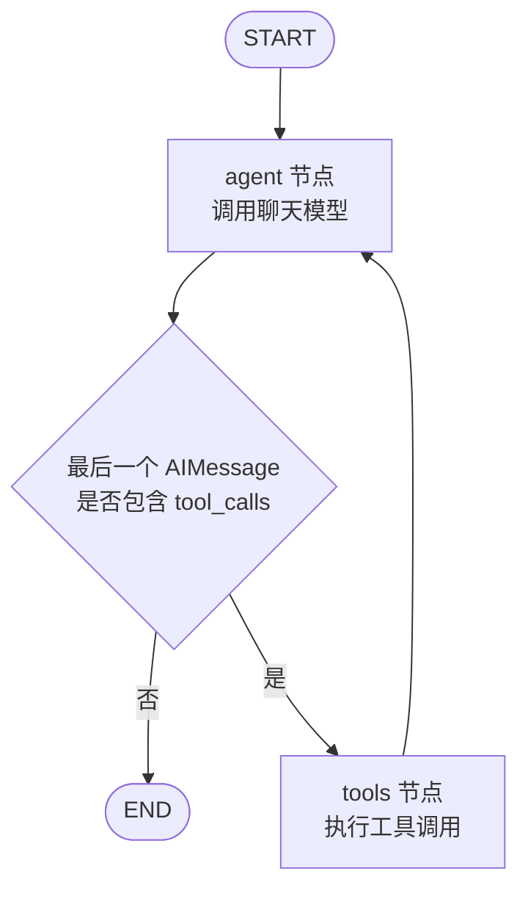
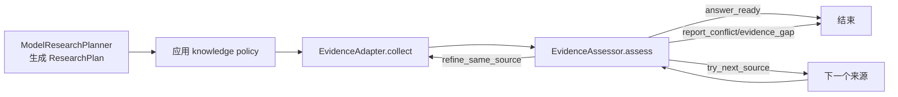

# 基于 LangGraph 的节点与状态编排调度技术文档

## 1. 文档范围与结论

本文说明当前仓库中 Agent 的真实执行方式，重点回答以下问题：

- LangGraph 图由哪些节点组成；
- 节点之间如何根据消息状态路由；
- `messages`、`remaining_steps` 等图状态如何变化；
- 会话持久化状态与 LangGraph 内存状态如何配合；
- 工具去重、上下文压缩、运行中追加、研究路由和子 Agent 位于图内还是图外；
- 一次 `/chat` 或 `/chat/stream` 请求从进入到结束如何调度。

核心结论是：当前系统采用“LangGraph ReAct 核心循环 + 应用层运行时编排”的混合模式。主图由 `langgraph.prebuilt.create_react_agent()` 生成，不是仓库中手写的完整 `StateGraph`；会话、恢复、SSE、去重、预算、重试和持久化由应用代码包在图的输入、工具和事件流外围。

当前代码的主图可以抽象为：



如果使用 LangGraph `create_react_agent` 的 `version="v2"` 语义，`agent` 产生的每一个工具调用会通过 `Send` 分发到一个 `tools` 执行分支；工具结果被写回消息状态后，流程再次进入 `agent`。仓库调用 `astream_events` 时使用的是事件协议版本 `v2`，这与预构建 ReAct 图的工具分发版本不是同一个概念，二者不要混淆。

## 2. 代码入口和模块分工

| 层次 | 代码位置 | 职责 |
| --- | --- | --- |
| HTTP 入口 | `backend/main.py` | 校验请求、会话创建、前台 run 互斥、SSE/同步响应和最终落盘 |
| 图构建 | `backend/agent.py:869-894` | 创建模型、聚合工具、挂载可选研究规划工具并生成编译后的 ReAct 图 |
| 图驱动器 | `backend/agent.py:919-2687` | 组装模型输入、调用 `astream_events`、转换事件、处理重试和完成门禁 |
| 工具集合 | `backend/tools.py:3004-3162` | 工具注册、MCP 工具加载、RAG/Skill 工具加载及运行时包装 |
| 工具运行时 | `backend/tools.py:903-1164` | 调用键、缓存、同 run 去重、并发等待、副作用阻断和工具审计 |
| 运行时上下文 | `backend/runtime_context.py` | 通过 `ContextVar` 传递 `session_id`、`run_id`、知识策略和来源调用预算 |
| 会话事实源 | `backend/session_store.py:433-1233` | 会话消息、任务计划、阶段结果、primary result、产物和恢复上下文持久化 |
| 运行中追加 | `backend/run_append.py` | 按 `(session_id, run_id)` 排队并在下一次模型调用前注入用户追加指令 |
| 研究编排 | `backend/agentic_research/` | 独立的受预算证据规划/收集/评估工作流；不是主图中的自定义节点 |
| 子 Agent | `backend/subagents.py` | 每个子任务单独创建一个 ReAct 图，可同步执行或后台执行 |

## 3. 主图如何构建

### 3.1 `build_agent()` 的构建步骤

`backend/agent.py:build_agent()` 的实际顺序如下：

1. 从配置文件加载模型连接信息。
2. 创建聊天模型，并包裹为 `AppendAwareChatModel`。
3. 调用 `get_all_tools()` 聚合工作区文件工具、搜索工具、任务记录工具、RAG 工具、Skill 工具和可用 MCP 工具。
4. 如果 Agentic Research 配置启用，额外创建一个 `plan_research_route` 工具；研究工具本身仍保留在主 Agent 可见工具列表中。
5. 调用：

   ```python
   agent = create_react_agent(
       model=llm,
       tools=_react_tools_for_runtime(visible_tools, research_runtime),
       state_schema=None,
   )
   ```

6. 给编译图设置应用名称 `chat_agent`，并把研究 runtime 作为属性挂在编译图对象上。

`_react_tools_for_runtime()` 当前只返回工具列表的副本，并不替换或裁剪工具。因此研究 runtime 的主要作用是构建规划工具和提供可选的独立研究 API，而不是把主图改造成另一种图结构。

### 3.2 `state_schema=None` 的含义

仓库没有传入自定义状态 schema。按照当前 LangGraph `create_react_agent` 的默认行为，图状态使用默认 `AgentState`，核心字段为：

```python
class AgentState(TypedDict):
    messages: Annotated[Sequence[BaseMessage], add_messages]
    remaining_steps: NotRequired[int]
```

其中：

- `messages` 是图的主要状态；`add_messages` reducer 会把节点返回的消息更新合并到现有消息序列，而不是简单覆盖整个列表。
- `remaining_steps` 由 LangGraph 根据本次调用的递归限制和已执行步数维护，用于防止 ReAct 循环无限运行。
- 当前仓库没有向图状态加入 `session_id`、`task_plan`、`research_trace` 或 `artifacts` 等字段。
- 当前仓库也没有使用 `response_format`、`pre_model_hook`、`post_model_hook`、`interrupt_before` 或 `interrupt_after` 参数，因此图中没有额外的钩子节点、结构化输出节点或人工确认中断节点。

这一区分很重要：前端看到的任务进度并不等于 LangGraph state。任务进度是应用层持久化投影，保存在 `SessionStore` 管理的会话数据中。

### 3.3 当前图的节点和边

调用 `create_react_agent` 后，当前主图等价于以下节点和路由：

| 节点/路由 | 输入 | 输出或下一步 |
| --- | --- | --- |
| `agent` | 当前 `state["messages"]` | 调用模型，追加一个 `AIMessage` |
| `agent` 路由 | 最后一个 `AIMessage` 的 `tool_calls` | 无调用则 `END`；有调用则进入 `tools` |
| `tools` | 一个或多个工具调用 | 追加对应 `ToolMessage`，然后回到 `agent` |
| `END` | 无待处理工具调用的最终消息 | 图执行结束 |

在 `version="v2"` 的预构建图语义下，最后一个 `AIMessage` 中的多个工具调用会分别成为 `Send("tools", ...)` 任务，每个工具调用单独执行。工具节点完成后，`ToolMessage` 通过 `messages` reducer 合并回图状态。

主 Agent 的 `astream_events()` 调用没有覆盖 `version` 参数，使用 LangChain/LangGraph 当前默认的事件协议参数 `version="v2"`：

```python
agent.astream_events(
    {"messages": messages},
    config={"recursion_limit": MAX_AGENT_STEPS},
    version="v2",
)
```

当前 `MAX_AGENT_STEPS = 180`。它是每次图执行的递归上限，不是允许调用 180 个不同工具，也不等于模型生成 token 数。

## 4. 图状态与应用状态的两层模型

### 4.1 LangGraph 单次调用状态

每次主图调用的输入形态是：

```python
{
    "messages": [
        SystemMessage(...),
        SystemMessage(...),
        HumanMessage(...),
        AIMessage(...),
        ToolMessage(...),
        HumanMessage(...),
    ]
}
```

典型状态迁移为：

```text
初始 messages
    -> agent 追加 AIMessage(tool_calls=[...])
    -> tools 追加 ToolMessage(tool_call_id=..., content=...)
    -> agent 再次读取完整消息序列
    -> agent 追加无 tool_calls 的 AIMessage
    -> END
```

模型没有工具调用时，`agent` 直接追加最终 `AIMessage` 并结束；模型返回工具调用时，必须先完成对应的 `ToolMessage`，否则下一次模型调用可能违反 provider 的工具消息配对协议。

### 4.2 应用层运行状态

应用层维护的状态不进入图 schema，主要包括：

| 状态 | 保存位置 | 用途 |
| --- | --- | --- |
| `session_id` | API 参数、`ContextVar`、`session.json` | 标识会话并隔离历史、工具缓存和事件 |
| `run_id` | `_ACTIVE_RUNS`、`ContextVar`、事件 payload | 标识一次前台执行，形式为 `session_id:uuid` |
| 运行互斥 | `backend/main.py:_ACTIVE_RUNS` | 同一 session 同时只允许一个前台 run |
| `task_plan` | `task_plan.json` 与 `task_plan.jsonl` | 记录固定任务项、状态、详情和恢复依据 |
| `task_outputs` | `session.json.task_progress` | 保存可复用的阶段输出 |
| `primary_result` | `session.json.task_progress` | 保存最终产物的位置、类型和验证状态 |
| `stage_results` | `session.json.task_progress` | 保存阶段结果引用，避免重做昂贵步骤 |
| `artifacts` | `session.json.task_progress` | 保存中间或主要产物的去重列表 |
| 工具 transcript | `tool_events.jsonl` 和 assistant message 的 `tools` | 审计调用、结果和 call id |
| 追加指令 | 内存队列 + `task_progress.append_commands` | 将运行中的用户补充注入后续模型调用 |
| 模型用量 | `task_progress.usage` | 保存输入、输出、总量和缓存 token 统计 |

任务计划的不可变性约束：`set_task_plan` 合并快照时锁定任务身份（content/activeForm），并拒绝把 `completed` 任务降级为 pending/in_progress/failed（保留原状态并记录 warning）；`update_task_plan_todo` 单项更新同样拒绝该回退并写入 `task_plan_todo_update_refused` 审计事件。agent 驱动层内的计划消费点（完成门禁、恢复上下文投影、追加命令事件记录、上下文压缩缓存）使用 `build_agent` 注入的 workspace root 构造 `SessionStore`，不再依赖进程当前工作目录；编译后的 ReAct 图对象携带 `workspace_root` 属性。

### 4.3 为什么没有使用 LangGraph checkpointer

`create_react_agent()` 没有传入 `checkpointer` 或 `store`，调用图时也没有传入 LangGraph thread 配置。因此当前系统不是通过 LangGraph checkpoint 恢复会话，而是采用应用层恢复：

1. 请求进入时从 `SessionStore.get_history()` 读取 canonical 历史。
2. `_merge_history()` 优先保留服务端持久化历史，只接受客户端快照中真正新增的尾部内容。
3. `get_resume_context()` 读取 primary result、阶段结果、产物和任务计划中的已完成/未完成项。
4. `stream_agent_events()` 将这些数据投影成新的 `SystemMessage`、原生历史消息和当前 `HumanMessage`。
5. 从模型角度看，这是一次新的图调用；从应用角度看，它是同一 session 上的可恢复续跑。

这种做法使 session 文件成为跨进程、跨服务重启可读取的事实源，但也意味着 LangGraph 本身不会自动保存每个节点的 checkpoint。

## 5. 一次请求的完整调度流程

### 5.1 API 层准备 run

`POST /chat/stream` 和 `POST /chat` 都先执行以下逻辑：

1. 解析 `knowledge_policy` 或兼容的 `knowledge_mode`。
2. 拒绝空消息和互相冲突的知识策略。
3. 创建或读取 session。
4. 调用 `_acquire_session_run()`。若同 session 已有前台 run，则返回冲突信息，不追加新的 user message。
5. 将当前 user message 追加到 session，并把进度置为 `running`。
6. 获取全局缓存的编译 Agent。
7. 从服务端读取 canonical history，并与请求中的 history 合并。
8. 通过 `bind_runtime_context()` 绑定 session/run、知识策略和来源调用限制。

`/chat/stream` 随后启动事件生成器；`/chat` 复用同一个 `stream_agent_events()`，但在服务端消费事件后只返回最终 JSON。

### 5.2 图输入投影

`stream_agent_events()` 在真正调用图前构造 `messages`，顺序大致如下：

1. 主系统提示词。
2. Agent policy。
3. 当前知识策略和证据调用约束。
4. 可选的长期记忆上下文。
5. 可选的研究 synthesis context。
6. 当前 Skill catalog 摘要。
7. session resume context。
8. 经过压缩/裁剪的历史消息。
9. 当前 user message。

历史中的原生工具记录会转换回 LangChain 原生消息：

```text
AIMessage(tool_calls=[...])
ToolMessage(tool_call_id=..., content=...)
```

如果历史包含未配对的工具调用，`_repair_dangling_tool_call_messages()` 会移除不能安全回放的 dangling call，并保留诊断信息，防止向模型传入非法的工具消息序列。

### 5.3 上下文容量检查与压缩

上下文压缩发生在图调用之前，不是 `pre_model_hook` 节点。系统会把以下内容纳入 token 估算：

- 系统提示词和 Agent policy；
- 记忆、Skill catalog 和恢复上下文；
- 历史文本及原生工具 payload；
- 当前 user message。

当配置了模型上下文窗口且剩余空间低于阈值时，`context_compaction.py` 将较早的完整对话轮次交给独立的无工具摘要调用，保留最近配置数量的完整轮次和原生工具协议。默认关键参数为：

| 参数 | 默认值 |
| --- | ---: |
| `trigger_remaining_tokens` | 20,000 |
| `retain_recent_turns` | 3 |
| `reserved_output_tokens` | 4,096 |
| `summary_max_output_tokens` | 4,096 |
| `max_retries` | 1 |

压缩结果会做结构和 exact literal 校验，并缓存到 session。canonical session messages 不被摘要覆盖；图收到的是经过验证的本轮输入投影。如果压缩后仍超过输入预算，系统在图启动前返回结构化容量错误。

### 5.4 调用主图

输入准备好后，驱动器调用：

```python
event_stream = agent.astream_events(
    {"messages": messages},
    config={"recursion_limit": 180},
    version="v2",
)
```

驱动器以异步迭代方式读取底层事件，并额外每隔一段时间发出 heartbeat，避免长时间工具调用让前端误以为连接失效。

### 5.5 主图内循环

一个典型的模型驱动轮次如下：

```text
agent 节点
  读取 messages
  调用模型
  产生 AIMessage
      ├─ 无 tool_calls -> 图结束
      └─ 有 tool_calls -> tools 节点

tools 节点
  对每个 tool_call 执行工具
  产生 ToolMessage
  回到 agent 节点
```

模型可能在多轮中交替产生文字和工具调用。只有 `agent` 产生不含 `tool_calls` 的最终 `AIMessage`，LangGraph 才会走 `END`；应用层还会在图结束后执行自己的完成审计。

## 6. 模型节点与工具节点的详细行为

### 6.1 `agent` 节点

预构建图的 `agent` 节点负责：

1. 从 state 读取 `messages`。
2. 对消息执行模型 prompt pipeline。
3. 调用聊天模型。
4. 将模型返回值包装成 `AIMessage` 并追加到状态。
5. 根据 `AIMessage.tool_calls` 选择 `END` 或工具执行分支。

仓库没有把这些动作拆成多个自定义节点。系统提示词、Skill catalog、resume context 和当前请求都在图外组装为输入消息，而不是分别配置为 LangGraph 节点。

### 6.2 `tools` 节点

`tools` 节点由 `ToolNode` 负责分发和执行工具。工具列表来自 `get_all_tools()`，包括：

- 工作区浏览、读取、写入、复制、删除和脚本执行；
- 网页搜索和网页抓取；
- 个人知识库搜索；
- Skill 目录/详情/执行工具；
- 任务计划、阶段结果、primary result 和 pitfall 记录工具；
- 子 Agent 启动、查询和消息工具；
- 可用的外部 MCP 工具。

真正注册到 `ToolNode` 前，每个工具都会经过 `_wrap_tool_with_run_dedupe()`。因此 `ToolNode` 调到的并不一定是最原始的函数，而是包含运行时约束的 `StructuredTool` 包装器。

### 6.3 工具包装器的调度决策

工具包装器在实际执行前按以下顺序处理：

1. 规范化工具参数并生成调用键。
2. 查询同 run 内缓存。
3. 如果相同调用正在执行，等待前一个调用完成并复用结果。
4. 如果是副作用工具，检查是否应阻断重复写入。
5. 检查知识来源调用预算和当前运行策略。
6. 执行工具的同步或异步实现。
7. 缓存可复用结果，自动登记可识别的阶段/产物结果。
8. 写入 `tool_events.jsonl` 审计，包括执行、复用、去重、阻断或失败。

这套逻辑解决的是工具层幂等和安全问题，不改变 LangGraph 的节点拓扑。即使图在同一轮产生重复工具调用，工具 wrapper 也可以复用、等待或阻止实际副作用。

### 6.4 运行中追加指令

`POST /sessions/{session_id}/runs/current/append` 不会向正在运行的 LangGraph 图发送 `Command`，也不会调用 `interrupt()`。它的流程是：

1. 校验 session 当前有 active run。
2. 将内容按 `(session_id, run_id)` 放入 FIFO 队列。
3. 下一次 `agent` 节点调用模型时，`AppendAwareChatModel` 消费队列。
4. 将追加内容作为新的 `HumanMessage` 加到本次模型调用的输入副本末尾。
5. 记录 `append_command_injected` 事件和持久化状态。

因此，追加指令是“模型调用边界的输入增强”，不是一个独立的 LangGraph 节点，也不是 LangGraph checkpoint 更新。它不会打断当前正在执行的工具；如果 run 在下一次模型调用前结束，追加指令会被标记为 `not_applied`。

## 7. 应用层事件调度与 SSE

LangGraph/LangChain 的底层事件由 `stream_agent_events()` 转换为稳定的应用事件：

| 底层事件 | 应用事件 | 作用 |
| --- | --- | --- |
| `on_chain_start`，名称为 `LangGraph` | `debug: graph_start` | 标识图开始 |
| `on_chat_model_start` | `debug: model_start` | 标识模型调用开始 |
| `on_chat_model_stream` | `text` | 输出增量文本 |
| `on_tool_start` | `tool_call`、`tool_transcript_call` | 输出工具名称、参数和 call id |
| `on_tool_end` | `tool_result`、`tool_transcript_result` | 输出工具结果并更新步骤状态 |
| `on_chat_model_end` | `debug: model_usage/model_end` | 统计 token 用量 |
| `on_chain_end`，名称为 `LangGraph` | `debug: graph_end`、`done` | 进入完成审计和最终结果阶段 |

其中：

- `tool_transcript_call/result` 是服务端完整审计和 session 持久化使用的事件；
- `tool_call/result` 是前端可见的展示事件，重复调用的展示可能被抑制；
- `activity`、`progress` 和 `debug` 是应用层可观测性事件，不是 LangGraph state 字段；
- `session_id` 和 `run_id` 在 API 层被附加到可公开的结构化事件，保证前端不会把不同运行的事件串联。

同步 `/chat` 接口也消费完整的内部事件流，只是不把中间事件实时发给客户端；最后返回 `reply`、`usage` 和基于工具名推断出的 `research` 路由摘要。

## 8. 研究编排与主图的边界

### 8.1 当前实现不是一张统一的大图

`backend/agentic_research/orchestrator.py` 实现了一个独立的有限状态流程：



它使用 `ResearchPlan`、`EvidenceObservation`、`EvidenceAssessment`、`ResearchBudget` 和 `ResearchTrace` 作为自己的状态对象，不使用 LangGraph 的 `StateGraph` 状态 reducer。

### 8.2 主 Agent 如何接触研究能力

当研究功能启用时，`build_agent()` 只向主图工具列表增加 `plan_research_route`。主 Agent 仍然通过普通工具调用选择：

- 是否直接回答；
- 是否先调用 `plan_research_route`；
- 是否直接调用知识库、工作区或网页证据工具；
- 是否根据工具结果继续查找或生成最终答案。

`plan_research_route` 只生成受 schema 约束的路线建议，不执行搜索。真正的证据工具仍由主 ReAct 图的 `tools` 节点调用，因而在当前“Agent-owned research”路径中，它们是主图的普通工具。

代码中还提供 `run_agentic_research()` 和 `build_synthesis_context()`，可以由其他调用方先运行独立研究流程，再把经过验证的证据上下文作为 `synthesis_context` 传给主 Agent。但当前 `/chat` 和 `/chat/stream` 的调用路径传入的是空 `synthesis_context`，标准请求不会自动先运行 `AgenticResearchOrchestrator`。

因此，当前接口返回的 `research.route_class` 是根据本次主图实际调用过的工具名称做的应用层摘要：

- 调用了知识库工具或策略为 `required`：`explicit`；
- 调用了网页工具：`explicit`；
- 调用了 `plan_research_route`：`planned`；
- 以上都没有：`direct`。

它不是独立研究 orchestrator 的完整 `ResearchTrace`，也不是 LangGraph 节点状态。

### 8.3 研究预算

独立研究 orchestrator 的默认预算包括：

| 预算 | 默认值 |
| --- | ---: |
| 最大路线转换/来源调用 | 3 |
| 个人知识来源调用 | 1 |
| 工作区来源调用 | 2 |
| 网页来源调用 | 2 |
| 单次研究 deadline | 30 秒 |

主图直接调用证据工具时，`runtime_context` 和工具包装器仍会执行来源调用限制；这与独立 orchestrator 中的 `ResearchBudget` 是两层不同的保护机制。

## 9. 子 Agent 的编排方式

主 Agent 通过 `Agent` 工具启动子 Agent，而不是把子图直接嵌入主 LangGraph 图：

1. 主图的 `agent` 节点生成 `Agent` tool call。
2. 主图的 `tools` 节点执行 `Agent` 工具。
3. `Agent` 工具根据 `subagent_type` 选择通用、探索、计划或验证定义。
4. `run_subagent()` 再次调用 `create_react_agent(model=llm, tools=tools, state_schema=None)`，创建一个独立编译图。
5. 子图使用自己的 `messages` 和 `recursion_limit`，默认最大轮次来自子 Agent 定义。
6. 同步模式把结果作为工具字符串返回主图；后台模式立即返回 `async_launched`，子 Agent 在独立线程中运行。
7. 主图结束时，驱动器最多轮询后台子 Agent 若干次，并将已完成结果拼接到最终文本。

所以子 Agent 是“主图中的工具调用 + 工具内部启动另一张独立图”，不是当前实现中的 LangGraph subgraph 节点。子 Agent 的状态落在 `sessionss/subagents/*.task.json`、transcript 文件和 session 的 `subagent_tasks` 中。

## 10. 完成、重试和异常调度

### 10.1 图异常

如果 `astream_events` 读取过程中抛出异常，驱动器会：

1. 记录当前工具、最近工具结果和错误摘要。
2. 将一条包含错误上下文的 `HumanMessage` 追加到当前输入消息列表。
3. 修复 dangling tool call 消息。
4. 重新创建 `agent.astream_events()` 迭代器，从重建后的消息继续。
5. 最多执行 `MAX_AGENT_REPAIR_PASSES = 2` 次修复。

这不是 LangGraph checkpointer resume，而是应用层捕获异常后重新发起一次图调用。

### 10.2 模型输出不完整

图收到 `on_chain_end` 后，应用层会检查累积文本。如果只得到空文本或“正在继续”类未完成内容，驱动器会追加 continuation prompt，再启动下一轮图调用，并要求模型自行判断是继续工具调用还是直接回答。

### 10.3 完成门禁

应用层在图结束后还会检查：

- 是否存在工具错误；
- 是否有未完成的后台子 Agent；
- 是否存在未完成 task plan；
- 是否已经登记 `record_primary_result`；
- 当前最终文本是否足够形成回答。

如果 task plan 全部完成且已登记 primary result，completion gate 可以直接根据持久化结果生成最终文本；否则在修复预算内再次进入图。完成后，`main.py` 会持久化 assistant message、工具 transcript、usage、execution summary 和最终进度。

### 10.4 客户端断开

SSE 客户端断开时，主图生成器的 finally 分支会记录：

- `status = interrupted` 或 `blocked`；
- 已完成工具 call id；
- tool ledger 引用；
- `recovery_action = continue`。

下一次普通消息通过 session history、task plan 和 resume context 恢复；它不是从图内部 checkpoint 恢复。

## 11. 一次带工具调用的状态示例

假设用户请求需要读取工作区文件，简化后的状态变化如下：

### T0：图启动

```json
{
  "messages": [
    {"type": "system", "content": "..."},
    {"type": "human", "content": "读取目标文件并总结"}
  ]
}
```

### T1：`agent` 节点调用工具

```json
{
  "messages": [
    "...原有消息...",
    {
      "type": "ai",
      "content": "",
      "tool_calls": [
        {"id": "call-1", "name": "read_file", "args": {"path": "..."}}
      ]
    }
  ]
}
```

路由函数看到最后一条消息存在 `tool_calls`，将流程送到 `tools`。

### T2：`tools` 节点完成调用

```json
{
  "messages": [
    "...原有消息...",
    "...AI tool call...",
    {
      "type": "tool",
      "tool_call_id": "call-1",
      "name": "read_file",
      "content": "...文件内容或结构化错误..."
    }
  ]
}
```

工具结果已经通过 wrapper 做过路径校验、去重/缓存和审计。图再次进入 `agent`。

### T3：`agent` 节点生成最终回答

```json
{
  "messages": [
    "...原有消息...",
    "...AI tool call...",
    "...ToolMessage...",
    {"type": "ai", "content": "文件内容总结如下：...", "tool_calls": []}
  ]
}
```

由于最后的 `AIMessage` 没有 `tool_calls`，主图到达 `END`；随后应用层执行完成审计并写入 session。

## 12. 配置、限制和可观测性

### 12.1 主要运行限制

| 限制 | 当前值/来源 | 作用 |
| --- | --- | --- |
| 主图递归限制 | `MAX_AGENT_STEPS = 180` | 限制模型/工具循环规模 |
| 网页搜索次数 | `MAX_WEB_SEARCH_CALLS = 10` | 阻止重复搜索耗尽 run |
| 网页抓取次数 | `MAX_WEB_FETCH_CALLS = 5` | 限制网页抓取开销 |
| 图级修复轮次 | `MAX_AGENT_REPAIR_PASSES = 2` | 限制异常和不完整输出的重启次数 |
| 后台子 Agent 轮询 | `MAX_BACKGROUND_SUBAGENT_POLLS = 6` | 图结束前有限等待后台结果 |
| session 前台并发 | 每 session 1 个 | 防止消息和工具审计串线 |
| 研究 deadline | 默认 30 秒 | 限制独立证据编排时间 |

### 12.2 关键调试阶段

可以在 SSE 或 `task_progress.last_debug_stage` 中观察：

```text
agent_start
graph_start
model_start
tool_start
tool_end
model_usage
heartbeat
agent_error_retry
agent_tool_use_continuation
completion_audit_retry
graph_end
done
```

上下文相关阶段还包括：

```text
context_compaction_started
context_compaction_completed
context_compaction_reused
context_compaction_failed
skipped_unknown_context_window
```

诊断时应先区分：

1. 图没有启动：检查请求校验、session run 互斥和上下文容量。
2. 图已启动但没有工具事件：检查模型是否返回 tool call，以及工具 schema 是否注册。
3. 有 `tool_start` 没有 `tool_end`：检查工具执行、外部 MCP 连接或进程超时。
4. 有 `tool_end` 但重复执行：检查调用键规范化、同 run cache 和副作用策略。
5. 有 `graph_end` 但没有最终回答：检查完成审计、repair pass、后台子 Agent 和 `collected_text`。
6. 下一轮上下文不正确：检查 session canonical history、原生工具消息配对和 resume context，而不是先检查 LangGraph checkpoint，因为当前没有启用 checkpoint。

## 13. 扩展方式与当前边界

### 13.1 新增普通工具

普通能力的最小扩展路径是：

1. 在 `backend/tools.py` 定义带 schema 的工具。
2. 把工具加入对应工具集合，或由动态加载器返回。
3. 让 `get_all_tools()` 返回该工具。
4. 保证工具的参数、返回值和副作用策略可被 wrapper 处理。

这不会改变图拓扑，主 Agent 会在 `agent -> tools -> agent` 循环中使用新工具。

### 13.2 新增真正的 LangGraph 节点

如果需求是增加审批、分类、规划、验证或人工中断节点，当前工厂调用还不够，需要显式构建自定义 `StateGraph`，例如引入：

```text
class CustomState(TypedDict):
    messages: ...
    task_plan: ...
    approval: ...
```

然后显式定义节点、条件边、reducer、checkpointer 和恢复协议。否则把逻辑写在 `stream_agent_events()` 里，只会得到应用层外围调度，不会得到可由 LangGraph 检查点、条件边和 `Command` 驱动的节点状态。

### 13.3 当前架构的取舍

当前设计的优点：

- 主 ReAct 图简单，工具扩展成本低；
- 应用层可以独立控制安全、持久化、SSE 和恢复；
- session 文件可跨进程读取，不依赖 LangGraph checkpoint backend；
- 研究、子 Agent 和上下文治理可以按需启用。

当前边界：

- LangGraph state 不是完整业务状态，业务状态需要通过工具和 `SessionStore` 显式保存；
- 运行中追加没有图级中断语义，只能在下一次模型边界生效；
- 重试是重新启动图调用，不是从已保存的 LangGraph 节点 checkpoint 继续；
- 研究 orchestrator 与主图是两套状态机，当前标准 chat 路径主要使用 Agent-owned tool routing；
- 前台运行互斥和部分运行时缓存是进程内机制，若部署到多个 worker，需要把这些协调状态迁移到共享存储或分布式协调组件。

## 14. 源码索引

- 主图构建：`backend/agent.py:869-894`
- 主图事件驱动和输入投影：`backend/agent.py:919-2687`
- 运行中追加模型包装器：`backend/agent.py:95-181`
- 上下文容量和压缩入口：`backend/agent.py:1809-2027`、`backend/context_compaction.py`
- API 前台 run 和 SSE：`backend/main.py:204-279`、`backend/main.py:1495-1794`
- API 同步执行：`backend/main.py:1797-1955`
- 工具集合与加载：`backend/tools.py:3004-3162`
- 工具去重包装：`backend/tools.py:903-1164`
- 会话默认进度与恢复：`backend/session_store.py:576-703`、`backend/session_store.py:947-965`
- 任务计划状态：`backend/session_store.py:967-1233`
- 运行时上下文：`backend/runtime_context.py`
- 独立研究编排：`backend/agentic_research/orchestrator.py:194-304`
- 研究 runtime 和规划工具：`backend/agentic_research/runtime.py:48-167`
- 子 Agent 独立 ReAct 图：`backend/subagents.py:115-173`
- LangGraph 依赖声明：`requirements.txt:9-17`

## 15. 可选的 Workflow Graph 实现

除默认 ReAct 路径外，仓库现已提供一个默认关闭的 Workflow Graph。只有在 `runtime_config.json` 的 `workflow.enabled` 显式设为 `true` 后，`build_agent()` 才会选择该运行时；关闭时行为保持为本文前述的 ReAct 图。

### 15.1 固定拓扑

```text
START -> intake -> prepare_context -> route
  direct   -> direct_executor -> join
  planned  -> planner -> plan_guard -> approval_gate? -> scheduler
  research -> planner -> plan_guard -> approval_gate? -> scheduler
  clarify  -> clarification_gate -> finalize

scheduler -- Send(dispatch_task) --> join -> assess
assess -> validate -> finalize -> END
assess -> scheduler | planner | finalize
```

节点和边在 `backend/workflow_graph.py` 编译时固定。模型只提交 schema 受限的路由提议和任务数据；`workflow_policy.py` 校验能力、依赖、循环、预算和风险后才允许条件边继续。因此顶层节点不是“系统级工具”：它们是系统控制流，不能被 Executor 或 Research Agent 作为工具调用。

### 15.2 状态、工具与子图

- `WorkflowState` 保存可信请求上下文、路由、计划、任务结果、证据、产物、错误、审批和审计事件；并行结果通过 reducer 合并，旧 attempt 不会覆盖新 attempt。
- Executor 子图以单任务和 capability allowlist 运行，只有已授权工具会绑定到该任务；未授权调用在执行前返回 `tool_not_allowed`。单任务模型步数上限来自 `workflow.executor_max_steps`（默认 8，允许 1-64），由 `dispatch_task` 随每次任务分发传入。
- Research 子图复用现有受预算研究运行时，只向父图返回结论摘要、去重后的引用、缺口、预算和状态，不回传完整内部推理消息。
- `Send("dispatch_task", ...)` 只分发依赖已满足的任务；`join` 和 `assess` 汇聚结果并决定完成、重试、重规划或阻塞。
- 重规划路径会把受界的失败摘要注入 planner 输入：失败任务的标识、类型、错误类别与上下文摘要，以及已完成任务的"勿重复执行"清单；摘要与请求合计按 4000 字符预算截断。
- planner 异常时先降级到确定性单任务 planner（`deterministic_fallback_planner`），兜底计划同样经过 `plan_guard` 全量校验；兜底也失败才置 `blocked`，降级事件带 `planner_fallback_used` 标记。
- `plan_guard` 在全局能力注册表校验之外，还会校验每个任务的能力是 route 批准集（`route.required_capabilities`）的子集，违例以 `capability_outside_route` 原因拒绝，不依赖 planner 的 prompt 自律。

### 15.3 路由、恢复与审批

`route` 使用“LLM 提议 + Pydantic schema + 代码裁决”：LLM 不可指定图节点、边或未注册能力。高风险裁决会在 `approval_gate` 调用 LangGraph `interrupt()`；使用同一 `(session_id, run_id)` thread 调用 `POST /sessions/{session_id}/runs/{run_id}/workflow/approval` 才能恢复或拒绝该 checkpoint。除 route 阶段的 `risk_level` 外，`plan_guard` 还会按 `HIGH_RISK_CAPABILITY_HINTS`（默认空集，能力标识模式，匹配等同名或 `hint:` 命名空间前缀）对计划重评审批要求：计划中任一任务能力命中即进入审批门，空集时行为与仅按 route 风险判定完全一致。

当前 checkpoint backend 是进程内 `MemorySaver`，适用于单进程 rollout 和测试；跨进程恢复需要在部署前实现持久化 checkpointer。`SessionStore` 仍是跨运行的会话和业务结果事实源，workflow 只把经验证的阶段结果投影回 session。

### 15.4 rollout 与回滚

1. 保持 `workflow.enabled=false`，先运行现有 ReAct 路径。
2. 在受控环境开启 workflow，确认路由 schema、工具 capability 元数据和 checkpoint 生命周期。
3. 观察 `workflow_node` SSE debug/progress 事件、`task_results`、审批暂停和 stage result。
4. 出现异常时将 `workflow.enabled` 设回 `false` 并重启服务；历史 session 与已记录 stage result 不会被删除，后续请求会回到既有 ReAct 路径。
